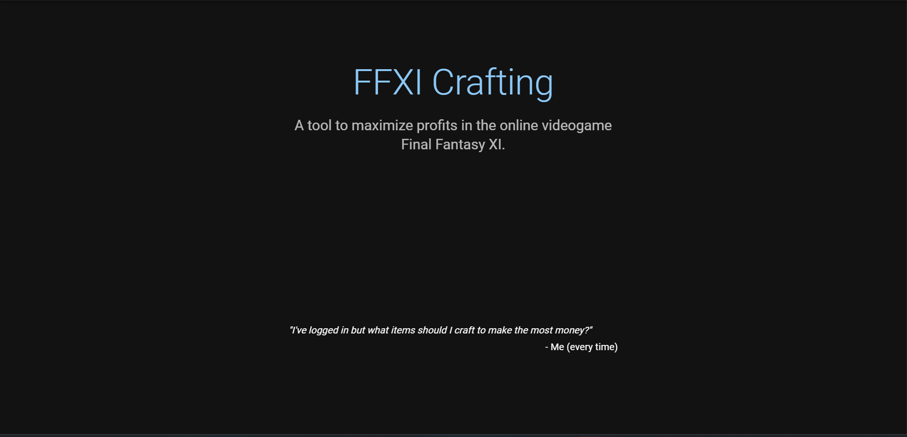

# ffxi-crafting

This is a monorepo for the frontend ffxi-crafting application and its API.

## READMEs

-   [React App](/ffxi-crafting-app/README.md)
-   [API](/api/README.md)

## Development with Docker

Configure the `.env` in the monorepo root as well as in each project as specified in the READMEs.

The `Makefile` offers 2 commands:

-   `make compose-up`: creates and starts containers for development with watch files
-   `make compose-down`: stops and removes containers

While Docker volumes are configured to watch for `/src` file changes in each project, you'll have to rerun this command to update containers if changes are made outside of `/src` (e.g., `package.json`, `.env`).

## Production (Heroku)

Check the `Procfile` to see the commands available to `heroku run ...`.

## Format

Prettier is configured to format files for all applications in this repo:

`npm run format`
